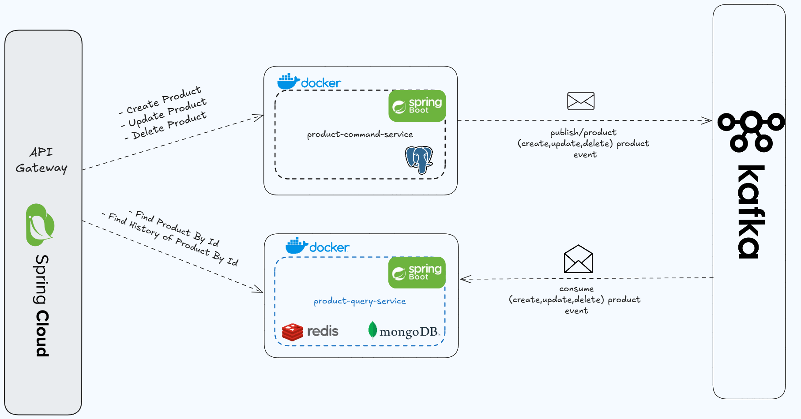

# 🛍️ E-commerce Microservice System

This project is a **microservice-based e-commerce system** built with **Spring Boot**, utilizing **Kafka for asynchronous event streaming**, **MongoDB for query-side persistence**, and **PostgreSQL for command-side persistence**. It follows the **CQRS** (Command Query Responsibility Segregation) and **event-driven architecture** principles.

---

## 🧭 Architecture Design Diagram



---

## 📂 Project Structure

```
.
├── api-gateway/                 # Spring Cloud Gateway for routing
├── product-command-service/     # Handles product creation/updates (writes)
├── product-query-service/       # Handles product reads
├── docker-compose.yml           # Kafka & Zookeeper
├── pom.xml                      # Root Maven configuration
└── README.md
```

---

## 🚀 Services Overview

### 1. **API Gateway**

* Entry point to the system.
* Routes requests to command or query services.
* Configured in `application.yml`.

### 2. **Product Command Service**

* Handles create/update/delete operations.
* Publishes events to Kafka.
* Technologies:

  * Spring Boot
  * Spring Data JPA
  * PostgreSQL
  * Kafka

### 3. **Product Query Service**

* Listens to Kafka events to maintain a read-optimized MongoDB view.
* Technologies:

  * Spring Boot
  * Spring Data MongoDB
  * Kafka
  * Redis (for caching)

---

## ⚙️ Technologies & Tools

* **Java 17+**
* **Spring Boot 3**
* **Kafka**
* **MongoDB**
* **PostgreSQL**
* **Redis (optional)**
* **Docker & Docker Compose**
* **Maven**

### 🧰 Development Tools

* **Redis Insight**: For exploring and managing Redis cache data during development.
* **Offset Explorer**: For browsing and debugging Kafka topics and message streams.
* **Docker Compose Support (per module)**: Each of the command and query services includes Docker Compose configuration to spin up Kafka and Zookeeper automatically, making it easier to run them independently during development without manually starting Docker Compose from the root.

---

## ▶️ How to Run the Project

### Step 1: Start Kafka & Zookeeper via Docker

From the root project directory:

```bash
docker-compose up -d
```

This will start Kafka and Zookeeper using the Docker Compose file.

### Step 2: Run the Product Command Service

From the `product-command-service` directory:

```bash
mvn clean install spring-boot:run
```

### Step 3: Run the Product Query Service

From the `product-query-service` directory:

```bash
mvn clean install spring-boot:run
```

Once all are running, services will interact via Kafka.

---

## 🔁 Kafka Integration

* The command service emits `ProductEvent` messages to a Kafka topic.
* The query service listens and builds projections into MongoDB.

Topics handled:

* `product-events`: Contains product change events (create/update).

---

## 🧾 Sample APIs

### Create Product (Command Service)

```http
POST /api/product-command-service/products
Content-Type: application/json

{
  "name": "Sample Product",
  "price": 99.99,
  "category": "Electronics"
}
```

### Get All Products (Query Service)

```http
GET /api/product-query-service/products
```

---

## 🛡️ Security & Auditing

The command service supports auditing via `SecurityAuditorAware`, which can be integrated with Spring Security for real user auditing.

---

## 🧪 Testing

Run unit and integration tests using:

```bash
./mvnw clean test
```

Test containers are used in the `product-query-service` to ensure MongoDB is tested in isolation.

---

## 📁 Configuration Files

Each service contains its own `application.yml` with environment-specific configurations. Kafka bootstrap servers, MongoDB/PostgreSQL URIs, and caching can be customized there.

---

## 🧰 Useful Maven Commands

```bash
./mvnw clean install        # Build all services
./mvnw spring-boot:run      # Run a specific service from its directory
```

---

## 📝 License

This project is licensed under the MIT License - see the [LICENSE](LICENSE) file for details.

---

Let us know if you'd like to see example Postman collections, Swagger UI setup, or deployment instructions to cloud environments like AWS or Azure.
